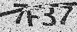
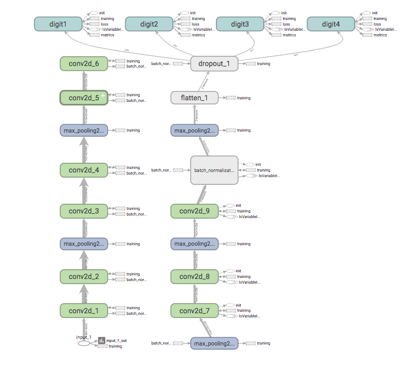
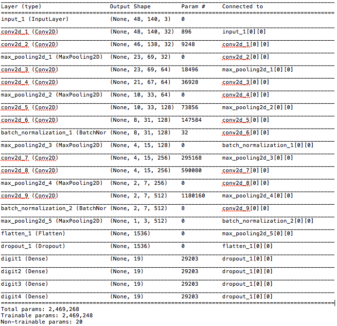
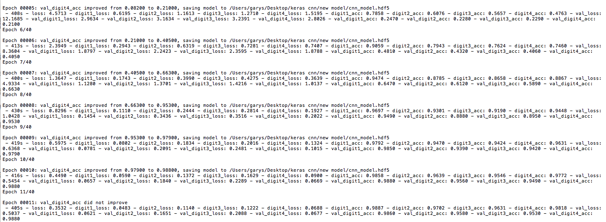
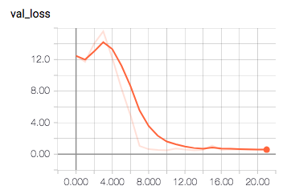
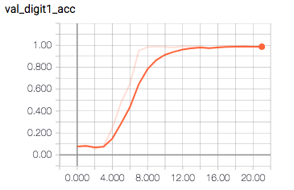
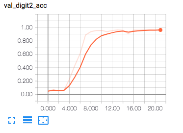
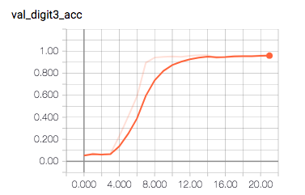
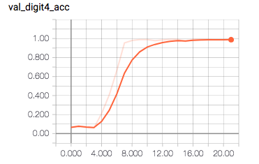

Keras-Python3.6-captcha
--
## Update: 2022.01.28
- Description
  - All the source code are under the `src` folder.
  - Fixed the `/model/train.py` which can be executed on the environment with **tensorflow 2.7.0**.
  - `./auto_get_image_by_selenium/`
    - `image`: The original image were fetched and labeled by selenium automatically.
    - `img_processed`: The processed images.
    - `label/labes.csv`: The labels.
  - `./download_img/`
    - `image`: The original image were fetched by `get_img.py`.
    - `processed_image`: The processed images.
    - `label5000.csv`: The labels.
    - `preprocess_image.py`: The code contains the preprocessing pipeline.
  - `/model/`
    - `train.py`: The code contains the model architecture and training procedure. I used the `auto_get_image_by_selenium/img_processed` as the training dataset and split by 0.2 for validation dataset.
    - `test.py`: Testing the model performance by the testing dataset which located on `./download_img/processed_image`.
    - `trained_model`: The folder contains the pretrained model.

## 使用Keras基於TensorFlow和Python3.6識別高鐵驗證碼
(僅供學術研究用途，請勿違法使用於大量自動訂票。)



### Image preprocessing
- 高鐵的驗證碼看起來還不算太不雜，就是有條很粗的曲線。
所以在訓練之前得先將驗證碼處理。
  1. 先用OpenCV去雜訊
  2. 黑白化 
  3. 去除曲線
  
- 具體方法是參考：
- [[爬蟲實戰] 如何破解高鐵驗證碼 (1) - 去除圖片噪音點?](https://youtu.be/6HGbKdB4kVY)
- [[爬蟲實戰] 如何破解高鐵驗證碼 (2) - 使用迴歸方法去除多餘弧線?](https://youtu.be/4DHcOPSfC4c)

但實際上高鐵驗證碼的每張圖片大小是不同的，因此比較不建議直接用screenshot後裁切的方式，這樣在處理曲線的方面也會比較完整。
爬取驗證碼就得靠session去抓，因為需要有cookies的關係。
具體的程式碼大概是這樣：
```python
Path("./image").mkdir(parents=True, exist_ok=True)
count = 0
session = requests.Session()
headers = {'user-agent': 'Mozilla/5.0'}
while count <= 5000:
    count += 1
    response = session.get('https://irs.thsrc.com.tw/IMINT/', headers=headers, cookies={'from-my': 'browser'})
    source = response.content.decode('utf-8')
    soup = BeautifulSoup(source, 'html.parser')
    img = soup.find('img')
    url = 'https://irs.thsrc.com.tw'+img.get('src')
    print(url)
    response = session.get(url, headers=headers, cookies={'from-my': 'browser'})
    with open('./image/'+str(count)+'.jpg', 'wb') as file:
        file.write(response.content)
        file.flush()
```

後來發現曲線處理得非常差因為可用來算迴歸線的像素點太少，因此我把驗證碼的原本的dpi乘以10倍之後再處理曲線，並且針對不同圖案大小需要不同的曲線寬度，最後在resize成固定的大小，我是存成（140, 48）。

處理完會像這樣：


圖片處理大概是我弄最久的部分了，大概也是對Python沒有很熟悉的關係。


### Architecture

架構是參考這篇文章再自己修改：[實作基於CNN的台鐵訂票驗證碼辨識以及驗證性高的訓練集產生器](https://github.com/JasonLiTW/simple-railway-captcha-solver)








最上面的輸入因為我圖片是(48x140)、顏色Channel是3(RGB)。

中間比較不一樣的是加入了兩層Batch_normalization來降低Overfitting的問題。

後面一樣Dropout(0.5)，放棄50％的神經元。

原本想造加一個4096個神經元的隱藏層，但後來發現Model的大小暴增到100MB以上，但加了能增加點準確率。

最後輸出四個Digit，因為高鐵的驗證碼是4位數，而每個Digit有19個神經元，因為仔細觀察可以發現高鐵的驗證碼由6個數字與13個英文字母組成。

可以在我建立的字典中了解：
```python
dic19 = {'2':0, '3':1, '4':2, '5':3, '7':4, '9':5, 'a':6, 'c':7, 'f':8, 'h':9, 'k':10, 'm':11, 'n':12, 'p':13, 'q':14, 'r':15, 't':16, 'y':17, 'z':18}
```

### Training

由於我對用Python繪圖還沒有足夠的了解，因此沒辦法自己寫出產生訓練集的code，只能請朋友幫忙一起標Label啦，感謝我的好友們。

我們手動標的5000張訓練樣本，丟給機器做訓練，只用CPU大約三小時內訓練完畢。

訓練機器硬體配置：
`CPU: Intel Core I5-6360U`
`RAM: DDR3L 16GB`

起出這個Model的準確率大約是85%左右，因為訓練樣本太少的問題。

因此我拿這個Model去高鐵的網站Try，假如有過那就把驗證碼爬回來並且自動標上Label，這邊我是用比較簡單的方法，使用Selenium去做這件事情，最後共得到11000張訓練樣本。

我是再拿新樣本訓練出新的Model畢竟手動可能會有標錯，最後新的模型測了5000張樣本準確率達到94.5%算是很夠用了。


以下是訓練過程：數據有底多，只截出部分週期。











### Reference
1. TemsorFlow+Keras深度學習 人工智慧實務應用 （書）
2. [實作基於CNN的台鐵訂票驗證碼辨識以及驗證性高的訓練集產生器](https://github.com/JasonLiTW/simple-railway-captcha-solver)
3. [~~TensorFlow識別字母扭曲干擾型驗證碼-開放源碼與98%模型~~](https://www.urlteam.org/2017/03/tensorflow%E8%AF%86%E5%88%AB%E5%AD%97%E6%AF%8D%E6%89%AD%E6%9B%B2%E5%B9%B2%E6%89%B0%E5%9E%8B%E9%AA%8C%E8%AF%81%E7%A0%81-%E5%BC%80%E6%94%BE%E6%BA%90%E7%A0%81%E4%B8%8E98%E6%A8%A1%E5%9E%8B/)

## ~~原始碼大略介紹 update: 2019.11.18~~
因為很久沒有修改程式碼，在一些對高鐵網站request的部分失效。
暫時沒有時間修改。
- 更新內容
  * 更README.md。
  * 路徑改為相對路徑，workspace請在`-Keras-Python3.6-captcha/cnn/`。
  * 更新`cnn_model.hdf5`，發先原本上傳的是錯誤的版本。
  * 更新`chromedriver，此為macos適用版本，請自行替換適合當前系統的版本。
- 主要步驟
  1. 先用`python catch img session/get img.py`抓一些驗證碼圖片下來。(網路部分還未修復)
  2. 使用`img process plus/img p plus.py`處理剛抓下來的圖片，標Label。
  3. 使用`keras tensor cnn/keras train.py`訓練model。
  4. 使用`get_imgae/2/get img drive`並用訓練好的model做預測，將預測成功的圖片再抓下來，自動標Label，就能有更大的資料集來訓練Model。
